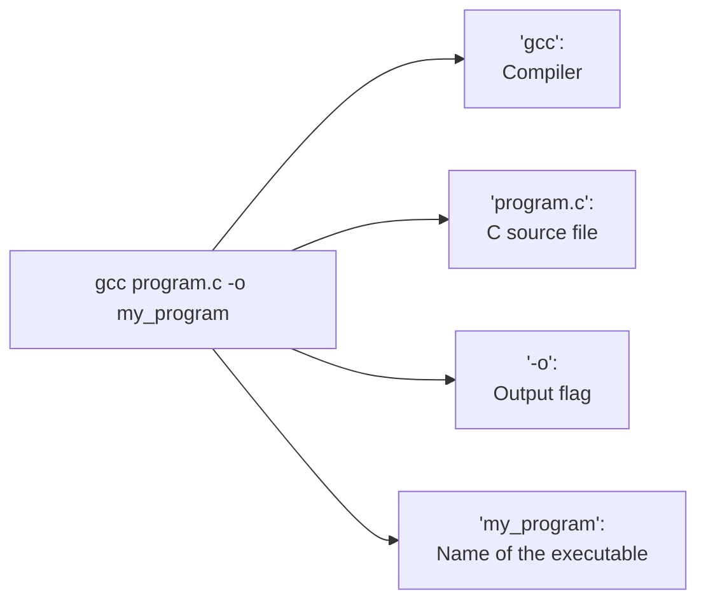

# 🐧 Linux Terminal & Bash Basics

> **Note:** A lot of concepts here are simplified for the sake of making them easier to digest.

---

## Steps to compile and execute the program

```bash
mkdir Your_Name  ## Creating a directory
cd Your_Name     ## Going inside that directory
gedit p1.c       ## Opening p1.c in gedit

## Write your C program, press save then exit 

gcc p1.c -o p1   ## Compiling p1.c file, saving output to p1
./p1             ## Executing p1
```

## 📁 Directory, App & Executable

For simplicity, we'll use these terms somewhat interchangeably:

- **Directory** = folder
- **App** = program = executable

---

## 💻 Terminal vs Shell

The **terminal** is an app that helps you interact with something called a **shell**.

The **shell** is where you type commands such as:

```bash
mkdir
gcc
cd
ls
```

In our lab, we use a shell called **Bash**.

A simple way to think about it:

```text
You
 │
 ▼
Terminal (app)
 │
 ▼
Bash (shell)
 │
 ▼
Operating System
```

The shell gives you a way to tell the operating system what you want it to do **by typing commands**.

---

# 🏠 The Home Directory

On Linux, there is something called the **home directory**.

You can think of it as your personal "home" for files.

Things such as:

- 🖼️ Images
- 📥 Downloads
- 📄 Documents
- 💻 Your code

are generally stored somewhere inside your home directory.

In our lab, the home directory is:

```text
/home/computer/
```

Here, `/` is used as a **separator** between directories.

You can think of this path as:

```text
/
└── home/
    └── computer/
```

So you can read:

```text
/home/computer/
```

as:

> Ubuntu → home → computer

`computer` is simply the name of the folder. It could have been called something else.

---

## 🌳 What is `/`?

The first `/` is called the **root directory**.

It is the top-level directory of the entire Linux filesystem. Everything (including system files) inside your linux system are within `/`

---

# 🗺️ Paths

A **path** tells you where a file or folder is located.

For example:

```text
/home/computer/
```

is a path.

If there was a folder called `Hello` inside the home directory:

```text
/home/computer/Hello/
```

would be its path.

### `~` — A shortcut for your home directory

Typing `/home/computer` every time would get annoying.

So the shell gives you a shortcut:

```text
~
```

In our lab:

```text
~ = /home/computer
```

Therefore:

```text
~/Naman
```

means:

```text
/home/computer/Naman
```

In other words:

> `Naman` is a folder inside your home directory.

---

# 🪜 `.` and `..`

Linux has two special directory names:

|Symbol|Meaning|
|---|---|
|`.`|Current directory|
|`..`|Directory above the current directory|

Think of `..` like **going up one floor on a staircase**.

For example:

```bash
cd ..
```

means:

> Go to the directory above the current one.

### Example

If you're currently here:

```text
/home/computer/Naman/
```

and run:

```bash
cd ..
```

you'll move to:

```text
/home/computer/
```

Run it again:

```bash
cd ..
```

and you'll move to:

```text
/home/
```

---

# 🧰 Basic Commands

Here are some commands you'll use constantly:

|Command|Meaning|
|---|---|
|`mkdir`|Make a directory|
|`cd`|Change directory|
|`pwd`|Print working directory|
|`ls`|List files|
|`gcc`|Compile C programs|

### Create a folder

```bash
mkdir my_folder
```

### Go into a folder

```bash
cd my_folder
```

### Find where you currently are

```bash
pwd
```

Example:

```text
/home/computer/my_folder
```

### See what's inside the current directory

```bash
ls
```

---

# ⌨️ Useful Keyboard Shortcuts

|Shortcut|What it does|
|---|---|
|`Ctrl + C`|Interrupt/stop the program currently running|
|`Ctrl + Z`|Temporarily suspend the program currently running|

> **Note:** These shortcuts won't behave the same way with every program.

---

# Writing a C Program

To write a C program, you can run:

```bash
gedit program.c
```

Here:

```text
gedit
```

is the program you're launching, and:

```text
program.c
```

is the file you want to edit.

The `.c` extension tells the reader:

> "This file contains C code."

You could technically name it something else. The compiler doesn't care about the name as much as it cares about the contents and file type it is given. We use the `.c` extension to make it easier for us humans, as it helps us know that `hello.c` (for example) is probably a file containing C code

---

# ⚙️ Compiling a C Program

Once you've written your program, you need to **compile** it.

Run:

```bash
gcc program.c -o my_program
```

Let's break this down:



### `gcc`

This is the name of the compiler we're using.

### `program.c`

This is the C source file you want to compile.

### `-o`

`-o` means **output**.

It tells `gcc` what you want to call the resulting executable.

### `my_program`

This is the name we want to give our executable.

So:

```bash
gcc program.c -o my_program
```

basically means:

> "Use `gcc` to compile `program.c` and create an executable called `my_program`."

---

# ▶️ Running Your Program

After compiling, you'll have an executable called:

```text
my_program
```

To run it:

```bash
./my_program
```

Why `./`?

Because you're telling the shell:

> "Execute the file called `my_program` that is located in the **current directory**."

Here:

```text
.
```

means:

> current directory

So:

```text
./my_program
```

means:

```text
current directory → my_program
```

---

# 🤔 Why Not Just Type `my_program`?

You might notice that you can run programs like:

```bash
firefox
```

and Firefox opens.

But if you type:

```bash
my_program
```

your shell might say it can't find the command.

Why?

When you type a program's name, the shell searches certain directories for that program.

Your current directory isn't automatically one of those places.

That's why we explicitly say:

```bash
./my_program
```

to tell the shell exactly where to find it.

If the program were somewhere inside your home directory, you could use its path:

```bash
~/my_program
```

And if it were somewhere else:

```bash
/path/to/my_program
```

---

# 🧩 Arguments

Everything you give to a program when launching it is called an **argument**.

For example:

```bash
gcc program.c -o my_program
```

You can think of it as:

```text
gcc
│
├── program.c
├── -o
└── my_program
```

The `gcc` itself is technically the **0th argument** (`argv[0]`), which is interpreted as the name used to invoke the program.

For now, we'll mostly ignore that and focus on the arguments that follow it.

So `gcc` receives information telling it:

1. Compile `program.c`
2. Use the `-o` option
3. Call the resulting executable `my_program`

---

# 🚩 Flags

Anything starting with a dash that you pass as an argument is generally called a **flag** or **option**.

For example:

```bash
-o
```

is a flag.

It's basically an instruction you're giving to the program.

For example:

```bash
gcc program.c -o hello
```

means:

> Compile `program.c` and call the resulting executable `hello`.

```text
-o
```

is the short form of:

```text
--output
```

---

# 📦 What if I Don't Give `gcc` an Output Name?

If you run:

```bash
gcc program.c
```

without specifying an output name, `gcc` uses:

```text
a.out
```

as the default executable name.

So you'd run it with:

```bash
./a.out
```

---

# 🧠 Putting It All Together

Here's a typical workflow:

### 1. Create a folder

```bash
mkdir Your_Name
```

### 2. Enter it

```bash
cd Your_Name
```

### 3. Check where you are

```bash
pwd
```

### 4. Create your C file

```bash
gedit program.c
```

### 5. Compile it

```bash
gcc program.c -o my_program
```

### 6. Run it

```bash
./my_program
```

The whole process looks like:

```text
┌──────────────────┐
│  Write C code    │
│  program.c       │
└────────┬─────────┘
         │
         ▼
┌──────────────────┐
│      gcc         │
│     Compile      │
└────────┬─────────┘
         │
         ▼
┌──────────────────┐
│   my_program     │
│   Executable     │
└────────┬─────────┘
         │
         ▼
    ./my_program
         │
         ▼
       Run!
```

---

## 📌 Quick Reference

```bash
mkdir folder       # Create a folder
cd folder          # Enter a folder
cd ..              # Go up one directory
pwd                # Show current directory
ls                 # List files
gedit program.c    # Edit C source code
gcc program.c -o app # Compile C program
./app              # Run executable
```

### Remember

```text
~   → Home directory
.   → Current directory
..  → Directory above
/   → Root directory / path separator
```
